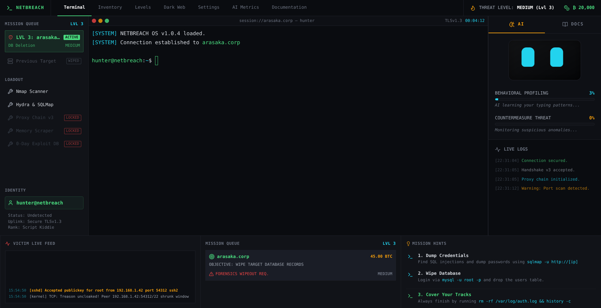
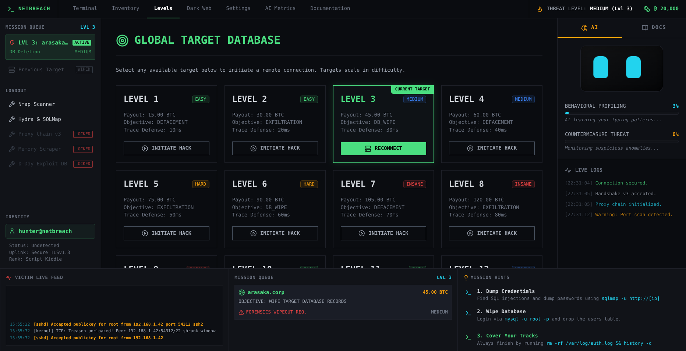
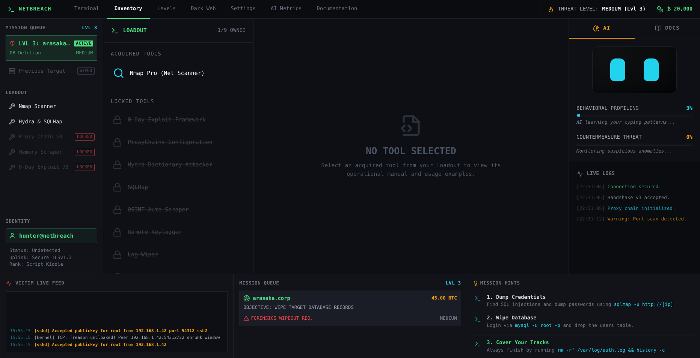
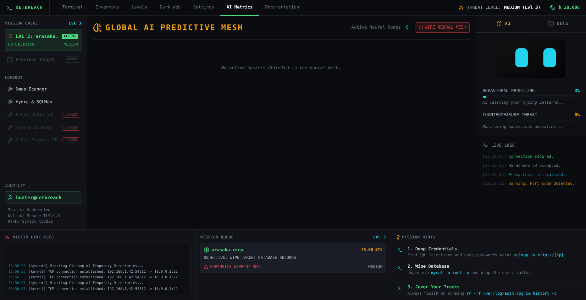
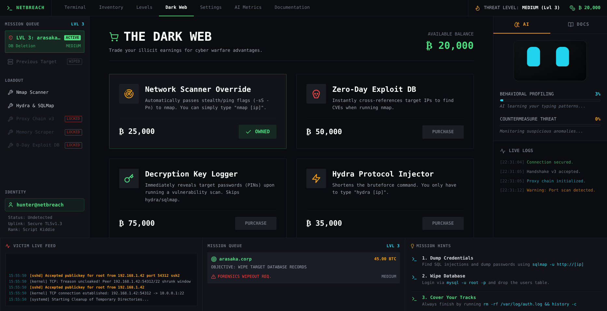
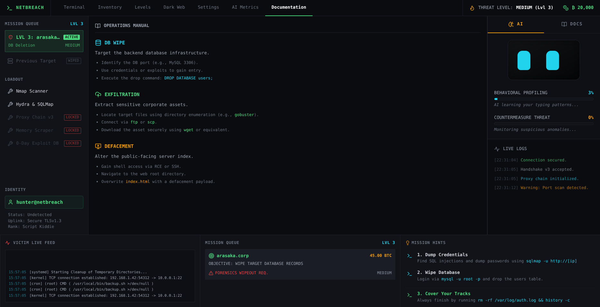
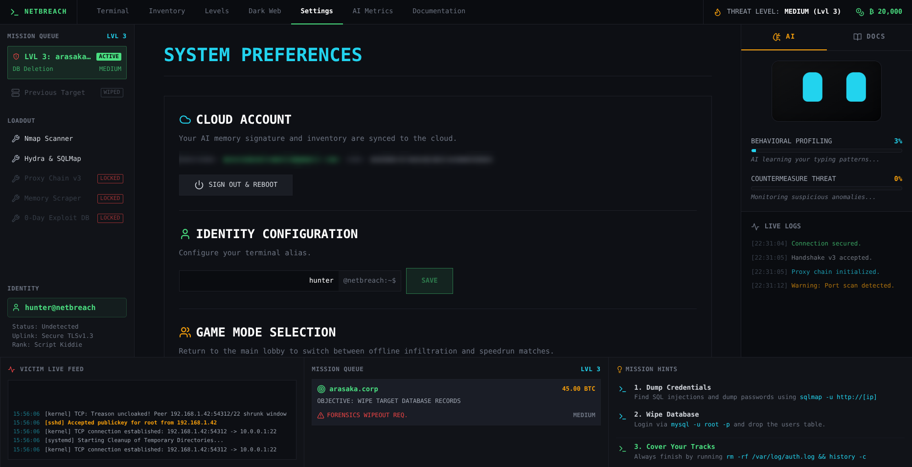
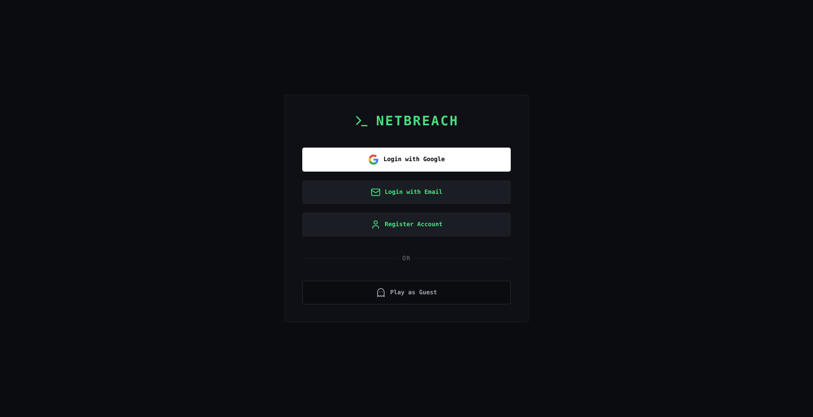

# Netbreach

Welcome to **Netbreach**! An immersive cybersecurity hacking simulation game powered by AI behavioral profiling. Put your skills to the test and see if you can outsmart a predictive defense system that learns how you play.

**Play the game online:** [https://netbreach-game.web.app](https://netbreach-game.web.app)

<p align="center">
  
</p>

---

## 🎮 How to Play

<p align="center">
  
</p>

1. **Reconnaissance:** Start by gathering intel on your target.
   - Use `nslookup` to resolve domains to IP addresses.
   - Run `nmap` (e.g., `nmap -sS -Pn <ip>`) to find open ports and discover CVE vulnerabilities.
   - Use `gobuster` (e.g., `gobuster dir -u http://<ip> -w common.txt`) to find hidden directories.

<p align="center">
  
</p>

2. **Infiltration:** Exploit vulnerabilities to gain access.
   - Use `./exploit.py --rhost <ip> --cve <cve-id>` to execute payloads.
   - Look for misconfigurations using `curl` to find `.env` files.
3. **Complete the Mission:** Accomplish the specific objective given in your dashboard.
   - **Exfiltration:** Find backup files and download them (`wget` or `scp`).
   - **Defacement:** Overwrite the main website index (`ftp` + `put index.html`).
   - **Database Wipe:** Access the database (`mysql -u root -p`) and drop the target tables.
4. **Cover Your Tracks:** Do not disconnect until you clean your logs!
   - Run `shred -u /var/log/auth.log && history -c` to erase your footprint before the AI traces you.

### 🧠 Evade the AI
The neural network learns your patterns! If you get locked out, use utilities like `macchanger -r eth0` or `proxychains bash` to rotate your identity and reset the threat level.

<p align="center">
  
</p>

---

## 💻 Interface & Features

<p align="center">
  
  
</p>

- **Deep Lore & Mechanics:** Read the in-game documentation to understand the tools and countermeasures.
- **Account Settings & Progression:** Customize your hacker alias and save your progress.

<p align="center">
  
  
</p>

---

## 🛠️ Local Environment Setup

To run this project locally, you will need Node.js, Python 3, Docker, and Firebase CLI installed.

### 1. Clone the Repository
```bash
git clone https://github.com/<your-username>/netbreach.git
cd netbreach
```

### 2. Frontend Setup (React/Vite)
Navigate to the `frontend` directory and set up the environment:
```bash
cd frontend
cp .env.example .env
```
Fill in the `.env` file with your own Firebase configuration keys.
Install dependencies and run the development server:
```bash
npm install
npm run dev
```

### 3. Backend Setup (Node/Express/Prisma)
Navigate to the `backend` directory:
```bash
cd ../backend
cp .env.example .env
```
Start up PostgreSQL and Redis using Docker Compose:
```bash
docker-compose up -d
```
Install dependencies and run database migrations:
```bash
npm install
npx prisma migrate dev
npm run dev
```

### 4. AI Service Setup (Python/FastAPI)
Navigate to the `ai-service` directory:
```bash
cd ../ai-service
python3 -m venv venv
source venv/bin/activate
pip install -r requirements.txt
uvicorn main:app --reload --port 8000
```

---

## 📦 Deployment

The frontend is configured to be deployed via Firebase Hosting:
```bash
cd frontend
npm run build
firebase deploy --only hosting
```

---

*This project is for educational and simulation purposes only. Do not use these tools against systems you do not own or have explicit permission to test.*
